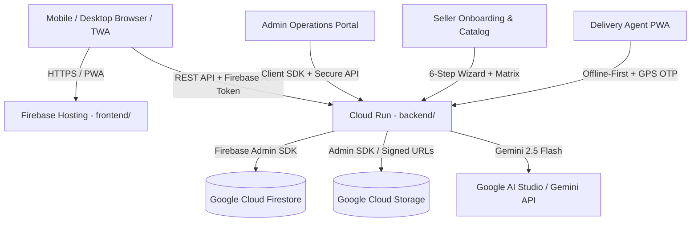

# 📚 Nari Niketan — System Documentation & Architecture

This directory contains the complete technical documentation, system architecture specifications, operational analysis, and deployment/packaging guides for the **Nari Niketan** e-commerce platform.

---

## 📑 Documents Index

### 1. Comprehensive System Architecture & Analysis
- **[`Nari_Niketan_Complete_System_Architecture.pdf`](./Nari_Niketan_Complete_System_Architecture.pdf)**: High-level architectural blueprint covering multi-tier cloud infrastructure, microservices breakdown, database schematics, and role-based access flows.
- **[`Nari_Niketan_Complete_System_Architecture_and_Analysis.pdf`](./Nari_Niketan_Complete_System_Architecture_and_Analysis.pdf)**: Detailed deep-dive into system bottlenecks, caching strategies, horizontal scalability, and multi-region deployment topology.
- **[`NARI_NIKETAN_Architecture_and_Implementation.pdf`](./NARI_NIKETAN_Architecture_and_Implementation.pdf)**: End-to-end design specifications covering frontend PWA state management, backend service orchestration, and payment confirmation workflows.

### 2. Technical Documentation & Manuals
- **[`Nari_Niketan_Complete_Technical_Documentation.pdf`](./Nari_Niketan_Complete_Technical_Documentation.pdf)**: Reference handbook detailing API endpoints, Zod schema validation rules, security middleware, and database models.
- **[`Nari_Niketan_Master_Analysis_2024.pdf`](./Nari_Niketan_Master_Analysis_2024.pdf)**: Full performance analysis, Core Web Vitals audit results, load test simulations, and optimization benchmarks.
- **[`project-documentation.html`](../frontend/project-documentation.html)**: Interactive visual HTML documentation dashboard featuring flow diagrams, component trees, and operational guides.

### 3. Native & Mobile Packaging
- **[`android-packaging-guide.md`](./android-packaging-guide.md)**: Step-by-step instructions for wrapping the Nari Niketan PWA into an Android TWA (Trusted Web Activity) / APK using Bubblewrap or PWABuilder.

---

## 🏛️ High-Level System Overview

---

## 🔗 Related Folders
- **Frontend Source**: [`../frontend/`](../frontend/)
- **Backend API & Rules**: [`../backend/`](../backend/)
